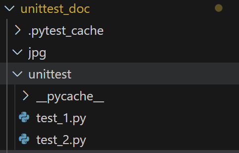
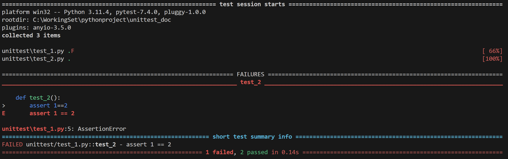

# 單元測試技術探討

## 大綱
### 一. 引言
- 1.1 測試的重要性
- 1.2 單元測試的定義與目的
- 1.3 測試依賴性的概念
### 二. 單元測試的基本概念
- 2.1 單元測試的定義
- 2.2 單元測試的組件
- 2.3 單元測試的優點與缺點
### 三. 測試依賴性的原因
- 3.1 什麼是測試依賴性
- 3.2 測試依賴性對測試的影響
- 3.3 如何識別測試依賴性
### 四. 實際應用與案例分析
- 4.1 單元測試與測試依賴性的實際案例
- 4.2 如何在專案中實施解決測試依賴性的方法
### 五. 總結
- 5.1 單元測試與測試依賴性的總結
- 5.2 未來研究與趨勢

------------------------------------------------------

## 一.引言
### 1.1測試重要性
在軟體開發過程中，測試是確保產品品質和穩定性的關鍵步驟。測試不僅可以幫助開發者確定程式碼是否正確運行，還可以提供一個反饋機制，幫助他們識別和修復潛在的錯誤和缺陷。以下將詳細探討測試的重要性：

確保程式碼品質
測試是評估程式碼品質的一個重要指標。通過單元測試、整合測試和系統測試等不同類型的測試，開發者可以確保程式碼達到預期的功能和性能要求。

預防錯誤和缺陷
測試可以幫助開發者在發布產品之前發現並修復程式碼中的錯誤和缺陷。透過自動化測試框架和持續整合/持續部署 (CI/CD) 流程，開發團隊可以更早地識別問題，從而降低後續修復錯誤的成本和風險。

提高程式碼可維護性
具有良好測試覆蓋率的程式碼通常更容易維護和修改。測試案例不僅可以作為程式碼行為的文檔，還可以確保在進行更改時不會破壞現有的功能。

增強開發者信心
有了全面的測試覆蓋，開發者可以更有信心地進行程式碼重構、優化和擴展。測試提供了一個安全網，確保在修改程式碼時不會引入新的錯誤或副作用。

增強產品品質和客戶滿意度
最終，高品質的測試可以提高產品的整體品質和性能，從而提升客戶滿意度和信任度。當用戶體驗到產品的穩定性和可靠性時，他們更有可能繼續使用和推薦該產品。

總之，測試是軟體開發過程中不可或缺的一部分，它不僅有助於提升程式碼品質，還可以預防錯誤、提高程式碼可維護性、增強開發者信心，以及提升產品品質和客戶滿意度。在接下來的部分，我們將深入探討單元測試以及與測試依賴性相關的議題，幫助讀者更好地理解如何有效地進行軟體測試。

------------------------------------------------------

### 1.2單元測試定義與目的

### 定義:

單元測試是軟體測試的一個階段，專注於驗證程式碼的最小可測試單元 —— 通常是函數、方法或類別 —— 是否按照預期的方式正確運行。在單元測試中，開發者會創建自動化的測試案例來驗證這些單元的行為，並檢查它們是否符合預定的規格和要求。

### 目的:
單元測試的主要目的有以下幾點：

- 1.驗證程式碼的正確性:
透過單元測試，開發者可以確保每個程式碼單元都按照預期的方式運行，並符合設計和實現的要求。這有助於減少由於程式碼錯誤而引入的問題，提高軟體的整體質量。

- 2.提供快速反饋
由於單元測試是自動化的，所以它們可以在開發過程中迅速執行。這使得開發者可以獲得即時的反饋，快速識別並修復程式碼中的問題，從而加速開發進度。

- 3.促進代碼重構與優化
當程式碼有良好的測試覆蓋率時，開發者更容易進行代碼重構和優化，因為他們可以信心地修改程式碼，並通過重新執行測試來確保新的變更沒有引入新的錯誤。

- 4.作為程式碼行為的文檔
單元測試也可以作為程式碼行為的文檔，幫助開發者和團隊了解程式碼的功能和預期的行為。這有助於提高程式碼的可讀性和可維護性。

- 5.減少後續測試成本
透過早期識別和修復問題，單元測試可以降低後續測試的成本和風險。在整合測試和系統測試階段，由於單元已經過全面驗證，所以測試過程將更加順利和高效。

- 6.總結來說，單元測試是一個關鍵的軟體開發實踐，它旨在確保程式碼的正確性、提供快速的開發反饋、促進程式碼重構和優化，並作為程式碼行為的文檔。在接下來的部分，我們將深入探討單元測試的實施方式、最佳實踐以及與測試依賴性相關的挑戰和解決策略。

------------------------------------------------------

### 1.3測試依賴性的概念

測試依賴性是指在進行軟體測試時，某些測試案例或測試結果依賴於其他測試案例或外部因素，從而影響測試的執行時間、穩定性和可維護性。在軟體開發中，依賴性通常是由於多個程式碼單元之間的相互關聯或順序執行導致的。

### 定義與例子
假設有兩個函數 f1和f2，以及三個輸入值 x1，x2 和x3，
這些函數之間存在依賴關係，如下所示：

x1→f1→x2→f2→x3

在這個依賴鏈中，函數 f2 需要等待函數f1 計算完成後才能執行，從而導致整體執行時間 

T = t1 + t2

為了解決這種測試依賴性，我們可以將原始的單一測試案例拆分成兩個獨立的測試案例，如下：

驗證 f1 的結果：

assert (x1,f1(x1)) == (x1,x2)

驗證 f2 的結果:

assert (x2,f2(x2)) == (x2,x3)

這樣，我們可以獨立地測試每個函數，並將整體執行時間 
T 縮短為最長的單一測試時間，即 

T = max(t1,t2)

### 解決策略

為了有效地管理和減少測試依賴性，開發者可以採取以下策略：

模擬或偽造外部依賴：使用模擬物件（Stubs）或偽造物件（Mocks）來模擬外部系統或資源，從而使測試案例獨立於外部因素。

拆分依賴測試案例：將具有明顯依賴關係的單一測試案例拆分成多個獨立的測試案例，以提高測試效率和穩定性。

使用並行執行：對於不依賴於相同資源的測試案例，可以考慮使用並行執行以提高測試效率。

測試資料的隔離：確保每個測試案例都使用獨立的測試資料和環境，從而減少測試依賴性和提高測試穩定性。

通過上述策略，開發者可以有效地管理和降低測試依賴性，從而提高測試效率、穩定性和可維護性。

------------------------------------------------------

## 二.單元測試的基本概念

### 2.1 單元測試的定義

單元測試是軟體開發中的一個核心實踐，專門用於驗證程式碼的最小可測試單元 —— 通常是函數、方法或類別 —— 是否按照預期的方式正確運行。這些測試通常是自動化的，並且由開發者在程式碼開發過程中創建和執行。

在單元測試中，開發者會根據程式碼的特定功能或行為編寫測試案例，這些案例包含一系列的測試步驟和斷言（assertions）。測試步驟描述了測試如何模擬程式碼單元的輸入，而斷言則用於檢查程式碼單元的輸出是否符合預期。

例如，對於一個簡單的函數，開發者可能會編寫以下測試案例：
```
def add(a, b):
    return a + b

def test_add():
    assert add(1, 2) == 3
    assert add(-1, 1) == 0
    assert add(0, 0) == 0
```

在上述測試案例中，我們對 add 函數進行了三個不同的測試。每個測試案例都包含一個或多個斷言，用於驗證 add 函數的不同輸入值是否產生了正確的輸出。

單元測試的主要目的是提供一個快速、可靠和可重複的反饋機制，以幫助開發者確保程式碼的正確性和穩定性。通過持續地運行單元測試，開發者可以及時發現並修復程式碼中的錯誤和缺陷，從而提高軟體的質量和可靠性。

總之，單元測試是一種專門用於驗證程式碼最小可測試單元正確性的自動化測試方法。它通過編寫和執行特定的測試案例來提供快速、可靠和可重複的反饋，從而幫助開發者確保程式碼的質量和穩定性。

### 2.2 單元測試的組件

單元測試通常由以下幾個主要組件組成，這些組件共同協作以確保程式碼的正確性和可靠性：

- 測試框架（Testing Framework）:
測試框架是一個提供測試運行環境和工具的軟體庫或框架。它通常提供了一套API和工具，用於創建、組織和執行測試案例，並自動化測試過程中的許多重複任務，如測試結果報告、錯誤追踪等。
常見的單元測試框架包括Python的unittest、JUnit（Java）、NUnit（.NET）等。

- 測試案例（Test Cases）:
測試案例是一組具體的測試步驟和斷言，用於驗證程式碼單元的特定功能或行為。每個測試案例都應該是獨立的，並專注於測試程式碼的一個特定方面。例如，對於上述的 add 函數，我們可以創建多個不同的測試案例來驗證不同的輸入和輸出組合。

- 斷言（Assertions）:
斷言是測試案例中的一個關鍵組件，用於檢查程式碼單元的輸出是否符合預期。如果斷言的條件不滿足，則測試將失敗，並生成一個錯誤報告。在大多數測試框架中，斷言通常以函數或方法的形式提供，並接受一個條件作為參數。例如，在Python的unittest中，我們可以使用assertEqual()、assertTrue()等斷言方法。

- 測試運行器（Test Runner）:
測試運行器是負責執行測試案例並收集測試結果的組件。它會自動運行所有的測試案例，並生成詳細的測試結果報告，包括成功的測試案例數量、失敗的測試案例數量、錯誤詳情等。例如，當使用Python的unittest框架時，unittest模組自帶了一個測試運行器，我們只需編寫測試案例和斷言，然後運行測試運行器即可。

總的來說，單元測試的主要組件包括測試框架、測試案例、斷言和測試運行器。這些組件共同協作，提供一個完整的單元測試解決方案，以確保程式碼的正確性和可靠性。


### 2.3 單元測試的優點與缺點

### 優點：

- 提高程式碼品質：
單元測試可以確保每個程式碼單元按照預期運行，從而提高整體程式碼的質量。它有助於發現和修復程式碼中的錯誤和缺陷，並促使開發者寫出更穩健、可靠的程式碼。

- 即時反饋：
單元測試是自動化的，能夠快速執行，提供即時的測試結果反饋。這使得開發者可以在開發過程中及時發現問題，並立即進行修復，從而提高開發效率。

- 促進重構和維護：
當程式碼有全面的單元測試覆蓋時，開發者更容易進行程式碼重構和優化，因為他們可以信心地修改程式碼，並通過重新執行測試來確保新的變更沒有引入新的錯誤。

- 作為程式碼文檔：
單元測試案例也可以作為程式碼行為的文檔，幫助開發者和團隊了解程式碼的功能和預期行為。這有助於提高程式碼的可讀性和可維護性。

- 提高開發者信心：
有了全面的單元測試覆蓋，開發者可以更有信心地進行程式碼重構、優化和擴展，因為他們知道測試將幫助他們確保新的變更不會引入新的錯誤或副作用。

### 缺點：

- 需要額外的時間和資源：
創建和維護單元測試需要額外的時間和資源，尤其是在開發初期。開發者需要投入時間來撰寫測試案例，這可能會影響開發速度。

- 測試覆蓋率不足：
單元測試只能驗證程式碼的特定部分，如果測試覆蓋率不足，可能會遺漏一些潛在的錯誤和缺陷。因此，需要與其他類型的測試，如整合測試和系統測試，結合使用以提供全面的測試覆蓋。

- 測試依賴性問題：
在某些情況下，程式碼單元之間可能存在依賴關係，這可能會導致測試依賴性問題，增加測試的複雜性和執行時間。

- 可能過度依賴測試：
雖然單元測試是確保程式碼品質的重要手段，但過度依賴測試可能會導致開發者忽略其他重要的軟體開發實踐，如代碼審查、設計模式等。

總的來說，單元測試具有多個重要的優點，包括提高程式碼質量、提供即時反饋、促進重構和維護、作為程式碼文檔，以及提高開發者信心。然而，它也存在一些缺點，如需要額外的時間和資源、可能的測試覆蓋率不足、測試依賴性問題，以及可能過度依賴測試等。因此，在實施單元測試時，開發團隊需要仔細考慮這些優點和缺點，並確保找到一個適合的平衡點，以確保程式碼的質量和可靠性。

------------------------------------------------------


## 三. 測試依賴性的原因

### 3.1 什麼是測試依賴性

測試依賴性是指在軟體測試過程中，測試案例之間存在的相互依賴或相互影響的情況。這種依賴性可能是由於程式碼單元之間的相互關聯或順序執行導致的，它會影響測試的執行順序、效率和可維護性。

在測試依賴性的情況下，某個測試案例的結果可能會影響其他測試案例的執行，從而增加測試的複雜性和執行時間。例如，如果一個測試案例依賴於另一個測試案例的輸出或狀態，那麼當第一個測試案例失敗時，第二個測試案例也可能會失敗，即使其本身沒有問題。

此外，測試依賴性還可能導致以下問題：

- 測試順序依賴性：某些測試案例需要按照特定的順序執行，以確保測試的正確性。如果測試順序被打破，可能會導致測試失敗或產生錯誤的測試結果。

- 資源依賴性：某些測試案例可能依賴於外部資源，如資料庫、網絡服務或硬體設備，這會增加測試的不穩定性和可測性。

- 狀態依賴性：某些測試案例可能會改變程式碼的狀態，影響後續測試案例的執行結果，從而產生不可預測的測試結果。

總之，測試依賴性是指在軟體測試過程中，測試案例之間存在的相互依賴或相互影響的情況。這種依賴性可能會影響測試的執行順序、效率和可維護性，並可能導致測試失敗、不穩定的測試結果或增加測試的複雜性。因此，在進行軟體測試時，需要識別和解決測試依賴性問題，以確保測試的正確性和可靠性。


### 3.2 測試依賴性對測試的影響

測試依賴性對軟體測試產生了多方面的影響，這些影響可能會導致測試失敗、增加測試的複雜性和執行時間，並影響測試的可維護性和可靠性。以下是測試依賴性對測試的主要影響：

1. 增加測試複雜性：
測試依賴性使得測試案例之間存在相互依賴或相互影響的關係，這增加了測試的複雜性。開發者需要考慮測試的執行順序、依賴關係和狀態管理，以確保測試的正確性和一致性。

2. 影響測試執行順序：
由於測試依賴性，某些測試案例需要按照特定的順序執行，以確保測試的正確性。如果測試順序被打破或出現錯誤，可能會導致測試失敗或產生不可預測的測試結果。

3. 增加測試執行時間：
測試依賴性可能會導致測試案例之間存在順序執行的依賴關係，這可能會增加測試的執行時間。例如，如果一個測試案例失敗，可能會影響後續測試案例的執行，從而增加測試的總體執行時間。

4. 影響測試的可維護性：
測試依賴性使得測試案例之間存在相互依賴的關係，這可能會影響測試的可維護性。開發者需要仔細管理和維護測試之間的依賴關係，並確保測試的一致性和穩定性。

5. 降低測試的可靠性：
測試依賴性可能會導致測試失敗或產生錯誤的測試結果，從而降低測試的可靠性。如果測試案例之間存在依賴關係，一個測試案例的失敗可能會影響其他測試案例的執行結果，進而導致測試結果的不可靠。

總的來說，測試依賴性對軟體測試產生了多方面的影響，包括增加測試複雜性、影響測試執行順序、增加測試執行時間、影響測試的可維護性和降低測試的可靠性。因此，在進行軟體測試時，需要識別和解決測試依賴性問題，以確保測試的正確性、效率和可靠性。

### 3.3 如何識別測試依賴性

識別測試依賴性是解決測試問題的第一步。以下是一些常用的方法和技巧，用於識別測試中存在的依賴關係：

1. 分析測試案例之間的相互關係：
仔細分析測試案例，尋找是否存在相互依賴或相互影響的關係。特別關注那些依賴於其他測試案例輸出或狀態的測試案例。

2. 檢查測試順序：
檢查測試案例的執行順序，看是否有必要按照特定的順序執行。如果某些測試案例必須按照特定的順序執行，那麼它們之間可能存在依賴關係。

3. 分析外部資源依賴：
查看測試案例是否依賴於外部資源，如資料庫、網絡服務或硬體設備。這些外部資源可能會導致測試的不穩定性和可測性。

4. 觀察狀態改變：
注意測試案例是否改變程式碼的狀態，影響後續測試案例的執行結果。狀態改變可能會導致測試的不可預測性和不穩定性。

5. 使用測試工具：
利用專門的測試工具和框架，如靜態代碼分析工具、測試覆蓋率工具等，來自動識別和分析測試依賴性。

6. 進行代碼審查：
進行代碼審查，與團隊成員討論可能存在的測試依賴性問題，並共同尋找解決方案。

7. 創建測試依賴性圖：
使用圖形表示法，如依賴圖（Dependency Graph）或活動圖（Activity Diagram），來視覺化測試案例之間的依賴關係，以更清晰地識別和管理測試依賴性。

總的來說，識別測試依賴性是解決測試問題的關鍵步驟。通過分析測試案例之間的相互關係、檢查測試順序、分析外部資源依賴、觀察狀態改變、使用測試工具、進行代碼審查，以及創建測試依賴性圖等方法和技巧，可以有效地識別和解決測試依賴性問題，從而提高測試的正確性、效率和可靠性。

## 四. 實際應用與案例分析
### 4.1 單元測試與測試依賴性的實際案例

在軟體開發過程中，單元測試是確保程式碼正確性的重要手段。然而，當程式碼之間存在依賴關係時，測試就可能變得更加複雜和不穩定。以下我們將通過一個簡單的購物車系統示例來探討單元測試和測試依賴性的實際應用。

背景：我們正在開發一個基本的購物車系統，該系統包含兩個主要功能：

addToCart(productId, quantity)：將指定的產品ID和數量添加到購物車。
calculateTotalPrice()：計算購物車中所有產品的總價格。
為了確保這兩個功能的正確性，我們需要創建相應的單元測試。

測試依賴性問題：
在開始寫測試時，我們發現 calculateTotalPrice() 方法的測試案例依賴於 addToCart() 方法。具體來說，calculateTotalPrice() 需要購物車中的產品數據來計算總價格。這種依賴關係可能導致以下問題：

測試不穩定：如果 addToCart() 方法出現錯誤或變更，則可能影響 calculateTotalPrice() 的測試結果。
測試複雜性增加：需要確保 addToCart() 方法在 calculateTotalPrice() 測試執行前被正確調用。
解決方案：
為了解決這個問題，我們可以使用以下策略：

直接調用方法：在測試中直接調用 addToCart() 方法來更新 items 字典，然後測試 calculateTotalPrice() 方法。

```
def test_calculateTotalPrice(self):
    cart = ShoppingCart()
    cart.addToCart('P001', 2)
    cart.addToCart('P002', 1)
    
    assert cart.items == {'P001':2,'P002':1}
    
    total = cart.calculateTotalPrice()
    assert total == 30

```

檢查方法內部狀態：在測試中添加斷言來檢查 addToCart() 方法是否正確地更新了 items 字典。
```
assert cart.items == {'P001':2,'P002':1}
```
透過這些策略，我們可以確保 calculateTotalPrice() 方法在測試時可以獨立運行，從而提高測試的正確性、效率和可靠性。

### 總結：
這個實際案例展示了單元測試和測試依賴性的關係，以及如何通過直接調用方法和檢查內部狀態來解決測試依賴性問題。透過這些策略，我們可以確保單元測試的正確性和穩定性，從而提高軟體開發的品質和效率。

------------------------------------------------------

### 4.2 如何在專案中實施解決測試依賴性的方法

測試依賴性是單元測試中常見的問題，尤其在複雜的系統和具有多重依賴的程式碼中。為了有效地解決這個問題並提高測試的穩定性和可靠性，我們可以採取以下幾種策略：

1. 使用模擬物件（Mock Objects）：
模擬物件是測試中的一個常用技術，它可以模擬真實物件的行為，從而解除測試依賴性。例如，在上一個購物車系統的例子中，我們使用 MagicMock 來模擬 addToCart 方法的行為。但要注意，過度使用模擬物件可能會導致測試變得過於複雜和難以維護。

2. 分離測試資料：
確保測試中使用的資料是獨立於其他測試的。這可以通過在每個測試案例開始時重置或初始化測試資料來實現。在購物車系統的例子中，我們在每個測試案例開始時創建了一個新的 ShoppingCart 實例，以確保 items 字典是空的。
```
def setUp(self):
    self.cart = ShoppingCart()
```

3. 模組化和解耦程式碼：
確保程式碼的每個部分都是獨立的，並盡量減少程式碼之間的依賴。這不僅可以提高程式碼的可測試性，還可以使程式碼更容易維護和擴展。

4. 使用測試替身（Test Doubles）：
除了模擬物件外，還可以使用其他類型的測試替身，如測試假物件、假物件、假方法等，來替代真實的依賴物件，從而使測試更加獨立。

5. 建立良好的測試套件結構：
確保測試案例的結構清晰、組織有序，並根據功能、模組或其他邏輯結構進行分類。這不僅可以提高測試的可讀性和維護性，還可以使測試依賴性問題更容易被識別和解決。

### 總結：
解決測試依賴性問題是單元測試中的一個重要課題。通過使用模擬物件、分離測試資料、模組化程式碼、使用測試替身和建立良好的測試套件結構等策略，我們可以有效地解除測試依賴性，從而提高測試的正確性、穩定性和可靠性。在專案中實施這些方法不僅可以確保程式碼的質量，還可以提高開發團隊的生產力和效率。

--------------------------------

## 五. 總結
### 5.1 單元測試與測試依賴性的總結

在軟體開發過程中，單元測試是確保程式碼品質和功能正確性的重要手段。然而，當程式碼間存在依賴性時，測試的設計和執行就可能變得複雜和困難。本文通過實際的購物車系統案例，深入探討了單元測試和測試依賴性之間的關係，以及如何有效地解決測試依賴性問題。

從這個實際案例中，我們學到了以下幾點關鍵的觀念和策略：

1. 測試依賴性的問題：當一個測試案例依賴於其他測試案例或程式碼的輸出時，測試的穩定性和可靠性就會受到影響。這種依賴關係會增加測試的複雜性，並可能導致測試結果不一致或錯誤。

2. 解決測試依賴性的方法：為了有效地解決測試依賴性問題，我們可以使用多種策略，包括使用模擬物件、分離測試資料、模組化和解耦程式碼、使用測試替身，以及建立良好的測試套件結構。這些方法可以幫助我們確保測試的獨立性，從而提高測試的正確性和穩定性。

3. 實施策略的重要性：在專案中有效地實施這些策略不僅可以提高測試的品質和效率，還可以減少開發過程中的錯誤和問題，從而提高整體的開發效率和團隊生產力。

總之，單元測試和測試依賴性是軟體開發中不可或缺的部分。通過了解測試依賴性的問題和解決方法，我們可以更加有效地設計和執行單元測試，從而確保程式碼的品質和功能正確性，並提高開發團隊的生產力和效率。希望這篇文章能夠幫助你更深入地理解單元測試和測試依賴性，並在實際專案中應用這些知識和策略。

----------------------------------------------------------------

### 5.2 未來研究與趨勢

在軟體開發領域，單元測試和測試依賴性的研究和實踐一直在不斷地進步和演變。隨著軟體系統的複雜性不斷增加，測試依賴性問題也變得更加嚴重和普遍。未來，有幾個關鍵的研究方向和趨勢值得關注：

1. 自動化測試工具的發展：隨著人工智慧和機器學習技術的發展，未來的單元測試工具將更加智能和自動化。這些工具可以自動識別和解決測試依賴性問題，並提供更有效的測試覆蓋率和報告。

2. 持續整合/持續部署（CI/CD）的集成：在CI/CD流程中，測試依賴性的問題尤為重要。未來的研究將更加關注如何在持續整合和持續部署的流程中有效地管理和解決測試依賴性問題，以實現更快速、更可靠的軟體交付。

3. 微服務和容器化技術的影響：隨著微服務和容器化技術的廣泛應用，軟體系統的架構變得更加複雜。未來的研究將專注於如何在這種分散式和彈性的架構中有效地管理和測試依賴性，並提供更靈活和高效的測試策略。

4. 測試驅動開發（TDD）和行為驅動開發（BDD）的進一步整合：TDD和BDD是兩種廣泛應用的軟體開發方法，它們強調測試在開發過程中的重要性。未來的研究將探索如何進一步整合這兩種方法，以更有效地解決測試依賴性問題和提高測試的品質。

總之，單元測試和測試依賴性是軟體開發過程中的核心問題。隨著軟體開發技術和方法的不斷發展，未來的研究將更加專注於解決測試依賴性問題，並提供更有效和高效的測試策略和工具。這將有助於提高軟體品質，加速開發速度，並提升開發團隊的生產力和效率。


# 附錄:測試檔案規範

## 1.在 unittest 資料夾下建立測試檔案:


## 2.確保所有測試文件都遵循統一的命名規則:

測試文件以 test_ 開頭。 

資料夾名稱以 test_ 開頭。 

測試函數以 test_ 開頭。 

## 3.測試檔案範例:

test_1.py
```
def test_1():
    assert 1==1

def test_2():
    assert 2==2
```
說明： 

test_1.py 中的test_1()和test2()皆符合格式，且測試通過(pass)

test_2.py
```
def hello():
    assert 1==1

def test_3():
    assert 2==3
```
說明： 

test_2.py 中的 hello() 函數不符合命名規則，不會被納入測試項目。 

test_3() 測試失敗案例。

## 4.執行測試
執行以下命令： 
```
python test_runner.py 
```
結果:


### 1 failed, 2 passed